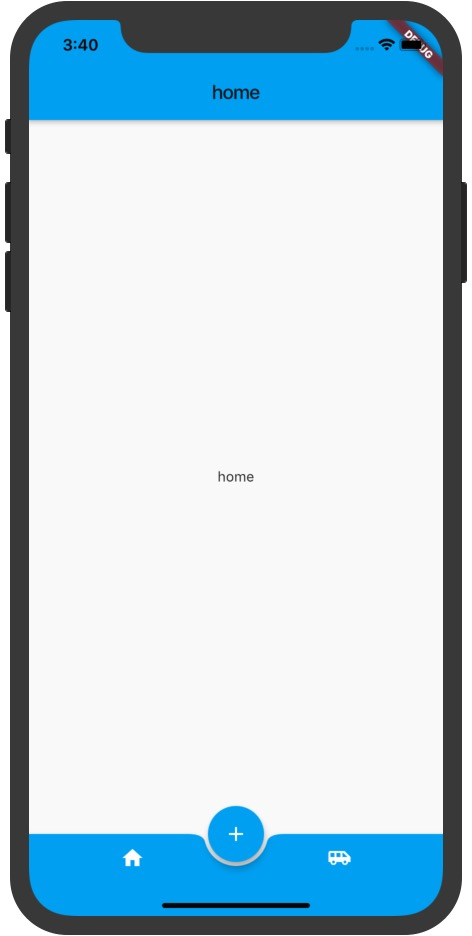

# flutter-demos
自己自学,写的demo


### flutter_demos_app

* 抽屉界面
* 搜索
* 贝塞尔曲线
* 状态保持
* 开屏闪屏


### keep_alive_app 
状态保持


### tabbar_add_app



### tabbar_app

```
type:BottomNavigationBarType.fixed //文字大小风格
```


```
type:BottomNavigationBarType.shifting //隐藏文字风格        
```


### frosted_glass_app


### github_client_app

flutter 中文网，最后一个实例
